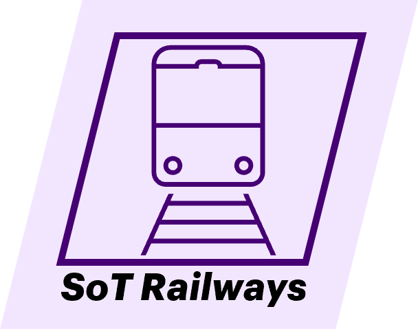

# Railways Ticketing System


## 📋 Project Overview

### **Purpose**
The **Railways Ticketing System** is designed to revolutionize the way railway tickets are booked and managed. Users can effortlessly register, log in, and handle their tickets, while admins get a powerful interface for overseeing users and tickets. This system promises efficient tracking and a seamless booking experience for all.

## Frontend Setup

### If you have already cloned the repository:

1. **Pull the latest changes:**
  ```bash
  git pull
  ```

2. **Checkout the working code:**
  ```bash
  git checkout working-code
  ```

3. **Navigate to the frontend directory:**
  ```bash
  cd frontend
  ```

4. **Install the dependencies (including legacy peer dependencies):**
  ```bash
  npm install --legacy-peer-deps
  ```

5. **Start the frontend development server:**
  ```bash
  npm run dev
  ```

### If you haven't cloned the repository yet:

1. **Clone the repository:**
  ```bash
  git clone https://github.com/praveen-saharan/Railways_Ticketing_System.git
  ```

2. **Navigate to the project directory:**
  ```bash
  cd Railways_Ticketing_System
  ```

3. **Go to the frontend directory:**
  ```bash
  cd frontend
  ```

4. **Install the dependencies:**
  ```bash
  npm install --legacy-peer-deps
  ```

5. **Start the development server:**
  ```bash
  npm run dev
  ```

## Backend Setup

### If you haven't cloned the backend repository yet:

1. **Clone the backend repository:**
  ```bash
  git clone https://github.com/praveen-saharan/Backend.git
  ```

2. **Checkout the working code:**
  ```bash
  git checkout working-code
  ```

### If you’ve already cloned the backend repository:

1. **Pull the latest changes:**
  ```bash
  git pull
  ```

2. **Checkout the working code:**
  ```bash
  git checkout working-code
  ```

## Database Setup

1. **Open MySQL Workbench and clean your database (if necessary):**

  - **Drop the existing `newdb` database:**
    ```sql
    DROP DATABASE newdb;
    ```

  - **Recreate the empty `newdb` database:**
    ```sql
    CREATE DATABASE newdb;
    ```

2. **If you don’t already have the `newdb` database, simply create it by running:**
  ```sql
  CREATE DATABASE newdb;
  ```

3. **Run your project and then go to the admin section to upload the `train.csv` file.**
<!-- ### **Scope**
This project encompasses:
- **Uer Roles:** Regular users and administrators.
- **Features:** Ticket creation, viewing, updating, deletion, user management, and role-based access control.
- **Key Functionalities:**
  - **User Registration/Login**: Sign up, log in, and manage accounts with ease.
  - **Ticket Management**: Create, view, update, and delete tickets effortlessly.
  - **Admin Panel**: Full control over user accounts and ticket data for admins.
  - **Role-based Access Control**: Tailored access levels for users and admins.>
  
### **Tech Stack**
- **Frontend**: React
- **Backend**: Java (Spring Boot)
- **Database**: MySQL
- **API Communication**: RESTful APIs
- **ORM**: JDBC

---

## 📽️ System Architecture

### **Explanation**
- The **Frontend** communicates with the **Backend** via RESTful APIs to perform actions like ticket creation, update, and deletion.
- The **Backend** interacts with the **Database** using **JDBC** to manage user and ticket data.
- The decoupled **Frontend** and **Backend** ensure scalability and maintainability.

---

## 🌟 Features and Requirements

### **Functional Requirements**
- **User registration/login**: Create an account and authenticate with a username and password.
- **Ticket Management**: Create, view, update, and delete tickets.
- **Admin Panel**: Manage users and tickets to maintain system integrity.
- **Role-based Access Control**: Different roles (admin, user) control access to specific actions.

### **Non-Functional Requirements**
- **Scalability**: Efficiently handle a growing number of users and tickets.
- **Security**: Securely hash passwords and protect sensitive data.
- **Responsive Design**: Mobile-friendly application supporting all device sizes.

--- -->

<!-- ## 📃 Database Design

# Railways_Ticketing_System Project
 -->

## 🚀 Setup and Installation

### Prerequisites

- Node.js (>= 18.x)
- npm or yarn

### Installation

Follow these steps to set up the project locally.

#### 1. Clone the Repository

```bash
git clone https://github.com/praveen-saharan/Railways_Ticketing_System.git
cd Railways_Ticketing_System
```

#### 2. Navigate to the Project Directory

- **Frontend**:

  ```bash
  cd frontend
  ```

#### 3. Install Dependencies

```bash
npm install --legacy-peer-deps
```

#### 4. Run the Development Server

- **Frontend**:

  ```bash
  npm run dev
  # or
  yarn dev
  ```

#### 5. Access the App

- **Frontend**: Open your browser and navigate to `http://localhost:5173`

### Troubleshooting

If you encounter any issues during installation or while running the project, consider the following:

- Ensure all dependencies are installed by running `npm install` or `yarn install`.
- Make sure that port `5173` (frontend) is not in use by other applications.
- Check the terminal/console output for any error messages and resolve them as indicated.

## 🤝 Contributing

1. Fork the project.
2. Create a feature branch (`git checkout -b feature-branch`).
3. Commit your changes (`git commit -m 'Add feature'`).
4. Push to the branch (`git push origin feature-branch`).
5. Open a Pull Request.
